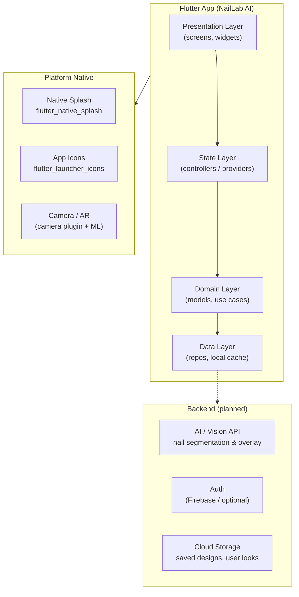
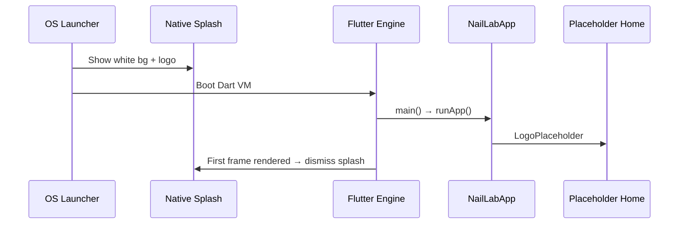
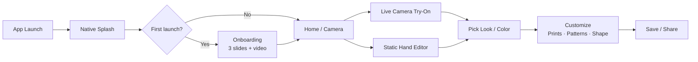
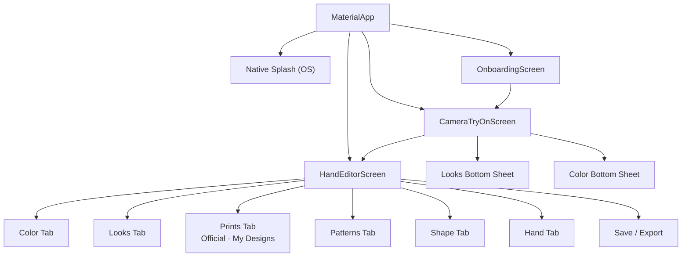
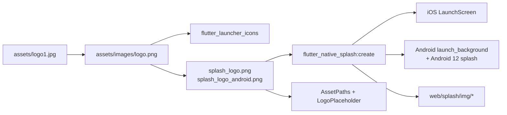
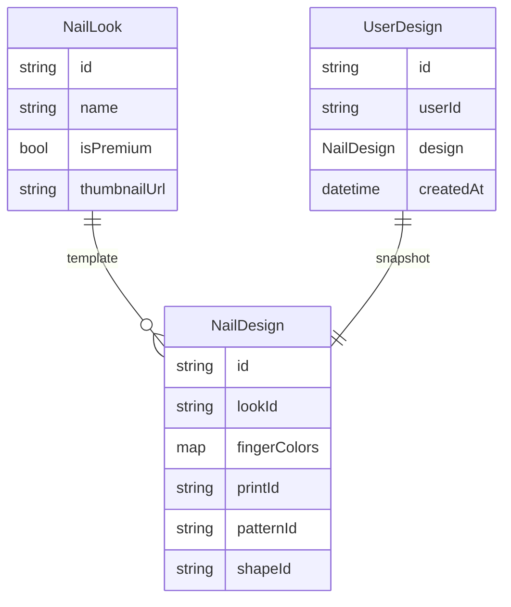

# NailLab AI

**NailLab AI** is a Flutter mobile app for AI-powered virtual nail try-on. Users preview nail designs on their own hand in real time, browse curated looks, and customize color, prints, patterns, and shape before saving their perfect manicure.

> **Status:** Early scaffold — branding, native splash, and design references are in place. Core product screens (onboarding, camera, editor) are planned next.

**Repository:** [github.com/lagrandecode/Nailslab-AI](https://github.com/lagrandecode/Nailslab-AI)

---

## Table of contents

- [Features](#features)
- [Architecture](#architecture)
- [Project structure](#project-structure)
- [Tech stack](#tech-stack)
- [Getting started](#getting-started)
- [Branding & splash](#branding--splash)
- [Design references](#design-references)
- [Roadmap](#roadmap)
- [License](#license)

---

## Features

### Implemented

| Area | Description |
|------|-------------|
| **Cross-platform shell** | iOS, Android, Web, macOS, Windows, Linux |
| **Branding** | App icon + native launch splash from `assets/logo1.jpg` |
| **Theme** | Material 3, pink accent (`#E91E8C`), white scaffold |
| **Asset pipeline** | Centralized paths in `lib/constants/asset_paths.dart` |
| **Loading placeholder** | `LogoPlaceholder` widget for in-app loading states |

### Planned (from design references)

| Area | Description |
|------|-------------|
| **Onboarding** | 3-step intro: “See Your Mani Live!”, “Try On Any Design”, etc. |
| **Live camera try-on** | Hand guide overlay, shutter, looks carousel |
| **Design editor** | Hand preview with tabs: Color, Looks, Prints, Patterns, Shape, Hand |
| **Looks library** | Official + My Designs, premium crown badges |
| **Save & share** | Capture and export finished manicure |

---

## Architecture

### High-level system view



### App launch flow (current)



### Planned user journey



### Layered architecture (target)

The codebase will grow into a standard Flutter layered layout:

```
┌─────────────────────────────────────────────────────────┐
│  presentation/     screens, widgets, navigation         │
├─────────────────────────────────────────────────────────┤
│  state/            Riverpod / Bloc controllers          │
├─────────────────────────────────────────────────────────┤
│  domain/           NailLook, NailDesign, use cases      │
├─────────────────────────────────────────────────────────┤
│  data/             repositories, DTOs, API clients      │
├─────────────────────────────────────────────────────────┤
│  core/             theme, constants, routing, utils     │
└─────────────────────────────────────────────────────────┘
```

| Layer | Responsibility | Current files |
|-------|----------------|---------------|
| **Presentation** | UI, navigation, user input | `lib/main.dart`, `lib/widgets/logo_placeholder.dart` |
| **Core** | Shared constants, theme, assets | `lib/constants/asset_paths.dart` |
| **State** | App/session state, feature controllers | — *planned* |
| **Domain** | Business models and rules | — *planned* |
| **Data** | API, local DB, asset catalogs | — *planned* |

### Navigation map (planned)



### Branding & splash pipeline



### Data model sketch (planned)



---

## Project structure

```
NailLab AI/
├── lib/
│   ├── main.dart                 # App entry, theme, root navigator
│   ├── constants/
│   │   └── asset_paths.dart      # Centralized asset path constants
│   └── widgets/
│       └── logo_placeholder.dart # In-app logo loading placeholder
│
├── assets/
│   ├── logo1.jpg                 # Master logo source
│   ├── images/
│   │   ├── logo.png              # App icon source (1024×1024)
│   │   ├── splash_logo.png       # iOS + web splash
│   │   └── splash_logo_android.png
│   └── nails/                    # UI design reference screenshots (32)
│
├── android/                      # Android project + generated splash/icons
├── ios/                          # iOS project + LaunchScreen + AppIcon
├── web/                          # Web entry + PWA manifest + splash
├── macos/                        # macOS desktop target
├── windows/                      # Windows desktop target
├── linux/                        # Linux desktop target
│
├── test/
│   └── widget_test.dart
│
├── pubspec.yaml                  # Dependencies + splash/icon config
└── analysis_options.yaml
```

### Key identifiers

| Property | Value |
|----------|--------|
| **Display name** | NailLab AI |
| **Package name** | `nail_lab_ai` |
| **Bundle ID** | `com.naillabai.nail_lab_ai` |
| **Org** | `com.naillabai` |
| **Flutter SDK** | `^3.11.5` |
| **Version** | `1.0.0+1` |

---

## Tech stack

| Category | Choice |
|----------|--------|
| **Framework** | [Flutter](https://flutter.dev) (Dart) |
| **UI** | Material 3 |
| **Linting** | `flutter_lints` |
| **Native splash** | [`flutter_native_splash`](https://pub.dev/packages/flutter_native_splash) |
| **App icons** | [`flutter_launcher_icons`](https://pub.dev/packages/flutter_launcher_icons) |
| **Testing** | `flutter_test` |

### Planned additions

| Category | Candidates |
|----------|------------|
| **State management** | Riverpod or Bloc |
| **Routing** | `go_router` |
| **Camera** | `camera` + custom overlay |
| **AI / vision** | On-device ML or cloud API |
| **Backend** | Firebase (auth, storage, remote config) |
| **Monetization** | RevenueCat (premium looks) |

---

## Getting started

### Prerequisites

- [Flutter SDK](https://docs.flutter.dev/get-started/install) (3.11+)
- Xcode (iOS/macOS)
- Android Studio / Android SDK (Android)
- CocoaPods (`sudo gem install cocoapods`) for iOS/macOS

### Clone & run

```bash
git clone https://github.com/lagrandecode/Nailslab-AI.git
cd Nailslab-AI
flutter pub get
flutter run
```

### Platform-specific

```bash
# iOS (simulator or device)
flutter run -d ios

# Android
flutter run -d android

# Web
flutter run -d chrome

# macOS
flutter run -d macos
```

### Run tests

```bash
flutter analyze
flutter test
```

### Build release

```bash
# Android App Bundle
flutter build appbundle

# iOS
flutter build ios

# Web
flutter build web
```

---

## Branding & splash

Logo source: `assets/logo1.jpg`

After changing the logo, regenerate platform assets:

```bash
flutter pub get
dart run flutter_launcher_icons
dart run flutter_native_splash:create
flutter clean && flutter run
```

> Native splash only appears on a **cold start** (not hot reload). Force-quit the app and relaunch to preview.

### Splash configuration (`pubspec.yaml`)

| Setting | Value |
|---------|--------|
| Background | `#FFFFFF` |
| iOS image | `assets/images/splash_logo.png` |
| Android image | `assets/images/splash_logo_android.png` |
| Android 12 | Same image, white background |
| Web | Enabled |

### Android 12 note

Android 12+ crops the splash icon to a circle. If the logo feels tight, add padding to `splash_logo_android.png` and regenerate.

---

## Design references

UI mockups live in `assets/nails/` (32 screenshots). They define the target product experience:

| Screen | Reference files | Notes |
|--------|-----------------|-------|
| Onboarding | `IMG_7750` – `IMG_7754` | Pink gradient, “See Your Mani Live!”, page dots |
| Camera try-on | `IMG_7755` – `IMG_7769` | Hand guide, shutter, looks carousel, Looks/Color tabs |
| Hand editor | `IMG_7770` – `IMG_7778` | Static hand, bottom tool tabs, save |
| Prints picker | `IMG_7779` – `IMG_7781` | Official / My Designs, premium badges |

Use these as the source of truth when implementing screens.

---

## Roadmap

- [x] Flutter project scaffold (`nail_lab_ai`)
- [x] App icon + native splash on all platforms
- [x] Design reference assets committed
- [x] GitHub repository initialized
- [ ] Onboarding flow (3 slides + optional video)
- [ ] Live camera try-on screen
- [ ] Hand editor with Looks / Color / Prints / Patterns / Shape tabs
- [ ] Looks catalog (official + user designs)
- [ ] AI nail segmentation & overlay
- [ ] Save, share, and gallery
- [ ] Premium looks + subscriptions
- [ ] Firebase backend & analytics

---

## License

Proprietary — © lagrandecode. All rights reserved.
